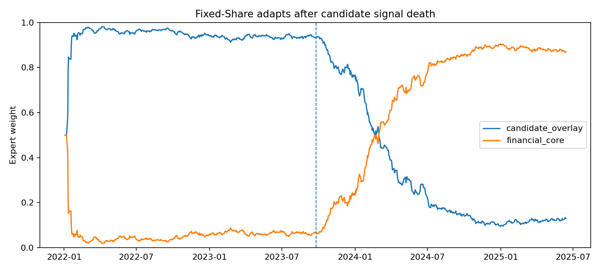
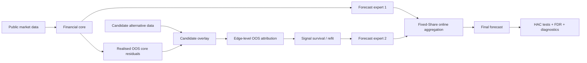
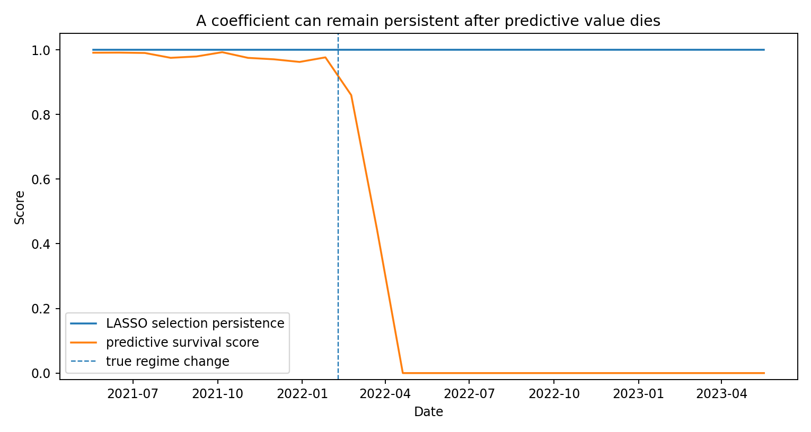

# Market Information Dynamics

### Online model trust under non-stationary financial data

[](https://github.com/elizadnl/market-information-dynamics/actions/workflows/tests.yml)


**Research question:** when a new information source appears predictive, how can a forecasting system tell whether it adds genuine out-of-sample information — and when should it stop trusting it?

This is an independent quantitative-research project on **non-stationary prediction, signal decay and online model selection**. A financial-market model is treated as a protected core; public physical-economy data provide a deliberately difficult candidate information layer. The statistical framework is domain-agnostic and can be reused with satellite, sentiment, web, microstructure or other alternative data.

> **Status:** methodology frozen for prospective monitoring from **1 September 2026**. Historical 2025–2026 results are retained as reused diagnostics, not relabelled as a fresh holdout.



## 30-second overview

- **12 financial targets** across FX, equities, volatility, rates and energy.
- **1 / 5 / 10 / 20 trading-day horizons** with direct forecasts.
- Public **FRED** market data and **IMF PortWatch** alternative data.
- Expanding walk-forward evaluation with explicit point-in-time availability rules.
- Sparse forecasting, edge-level OOS loss attribution and post-selection refitting.
- A protected financial core plus candidate-data residual overlays.
- **Fixed-Share online expert aggregation** to adapt model trust after regime changes.
- HAC forecast-comparison tests and Benjamini–Hochberg FDR control.
- A small **C++17** acceleration layer for a profiled deterministic bottleneck, with parity tests and CI.
- Negative results are frozen in the repository rather than removed after the fact.

For the compact research write-up, see **[`docs/RESEARCH_NOTE.md`](docs/RESEARCH_NOTE.md)**.

## Why this problem

A common quantitative-research failure mode is to confuse a relationship that is repeatedly selected with one that remains useful. In a non-stationary system, the harder question is not only:

> *What predicts the target?*

but also:

> *How much evidence should a model need before it is trusted, how quickly should old evidence decay, and how should the system recover when the best model changes?*

The project evolved around that distinction after its first alternative-data hypothesis failed out of sample.

## Research architecture



For each horizon `h ∈ {1, 5, 10, 20}`:

1. fit a financial-only direct sparse forecasting model;
2. generate genuine walk-forward core forecasts;
3. wait until the complete `h`-step outcome is realised;
4. fit candidate information only to historical **OOS core residuals**;
5. attribute candidate-edge value using realised marginal forecast-loss reduction;
6. refit surviving candidate edges after sparse discovery;
7. treat the core and candidate-overlay forecasts as competing experts;
8. combine them using causal Fixed-Share exponential weighting.

An `h`-step forecast cannot alter edge scores or expert weights until that `h`-step outcome is fully observable.

## Empirical research path

The repository keeps each stage, including the null results that motivated the next method.

| Stage | Question | Reused real-data result |
|---|---|---|
| **v1** | Does baseline PortWatch information improve one-day forecasts beyond financial history? | **No robust incremental value.** Mean skill vs financial-only ≈ **-0.10%**; no FDR-significant improvements. |
| **v2** | Is structural persistence enough to decide which edges survive? | No. Persistence filtering reduced some damage but usually still lost to the financial core. |
| **v3** | Can candidate data explain genuine OOS errors left by a protected core? | Adaptive gating reduced candidate-model damage, but beat the core in only **12/48** target–horizon comparisons; no FDR rejections. |
| **v4** | Can online learning adapt trust between the core and candidate model? | Fixed-Share beat the raw survival-overlay expert in **42/48** comparisons; relative to the core, the primary rule was approximately flat overall and **+0.11% mean RMSE skill at 20d**, with no FDR-significant improvement. |

The project therefore makes **no alpha claim**. The empirical contribution is the disciplined study of model trust under non-stationarity and a transparent record of which hypotheses failed.

Detailed frozen findings:

- [`docs/empirical_v1_findings.md`](docs/empirical_v1_findings.md)
- [`docs/empirical_v2_findings.md`](docs/empirical_v2_findings.md)
- [`docs/empirical_v3_findings.md`](docs/empirical_v3_findings.md)
- [`docs/empirical_v4_findings.md`](docs/empirical_v4_findings.md)

## Fixed-Share model trust

For expert weights `w_k,t` and bounded realised loss `ℓ_k,t`:

```text
w~_k,t+1 ∝ w_k,t exp(-η_t ℓ_k,t)

w_k,t+1 = (1 - α) w~_k,t+1 + α / K
```

The share term prevents a model from being permanently eliminated: if the regime changes, a previously weak expert can recover. The primary share parameter is pre-specified as `1/252` per realised update; nearby values are reported as sensitivity diagnostics rather than chosen after observing performance.

### Controlled falsification tests

The synthetic tests are not performance showcases; they provide known ground truth.

**Edge death.** A relationship remains repeatedly selected by LASSO after its true predictive value is removed. The survival layer must distinguish coefficient persistence from realised forecast utility.



**Model death.** A candidate expert is genuinely useful early and deliberately made worse after a regime switch. Fixed-Share should increase its weight while useful and move back toward the core after the signal disappears.


## Statistical design

The project includes:

- direct multi-horizon forecasting rather than recursive rollouts;
- expanding walk-forward estimation;
- target-only AR baselines;
- LASSO sparse structure discovery;
- OOS-residual candidate-model training;
- recency-weighted edge persistence, sign and strength diagnostics;
- edge-level marginal OOS loss attribution;
- post-selection Ridge refitting;
- protected-core candidate augmentation;
- causal online expert aggregation;
- horizon-delayed learning updates;
- horizon-aware HAC forecast-loss inference;
- Benjamini–Hochberg FDR control;
- explicit point-in-time alternative-data timing;
- controlled regime-switch falsification tests;
- a prospectively frozen evaluation protocol.

Directed edges indicate **lagged predictive association under the fitted forecasting system**, not structural causality.

## Data and point-in-time discipline

No employer or proprietary data are included.

- **FRED:** daily FX, equities, volatility, rates and energy series.
- **IMF PortWatch:** public chokepoint activity, downloaded in resumable year/chokepoint chunks.
- **Alternative-data timing:** physical features receive an explicit assumed availability lag; the historical API is not treated as a perfect vintage archive.
- **Physical transforms:** past-only smoothing and 52-week seasonal anomalies.
- **WTI:** first differences are used because the April-2020 negative-price episode makes log returns undefined.

See [`docs/data_provenance.md`](docs/data_provenance.md).

## Leakage rules

1. No random train/test split for time-series claims.
2. No scaler, feature selection or survival statistic may use future observations.
3. Candidate observations cannot enter before their assumed availability date.
4. `h`-step targets cannot alter models, edge scores or expert weights until fully realised.
5. Candidate models are trained on historical **OOS core residuals**, not in-sample residuals.
6. Candidate-edge utility is measured relative to the protected financial core.
7. Online expert weights use only already-realised forecast losses.
8. Overlapping `h`-step forecast-loss tests use horizon-aware HAC inference.
9. Multiple target/horizon tests are corrected within pre-specified comparison families.
10. Reused evaluation periods are labelled honestly; predictability is not causality.

## C++ acceleration

The research stack is Python-first. C++17 is used only for a measured deterministic hot path: lagged design-matrix construction.

The native implementation has:

- Python/C++ parity tests;
- GitHub Actions coverage;
- a benchmark script;
- automatic Python fallback.

See [`docs/cpp_acceleration.md`](docs/cpp_acceleration.md).

## Reproduce

### Windows

```powershell
python -m pip install -e ".[dev]"
python -m pytest -q

# Online aggregation uses the already-generated v3 forecast paths.
powershell -ExecutionPolicy Bypass -File scripts\run_online_aggregation.ps1
```

### Cross-platform

```bash
python -m venv .venv
# activate environment
pip install -e '.[dev]'
pytest

python -m market_information_dynamics.cli empirical-v4 \
  --v3-dir artifacts/empirical_v3 \
  --experiment-config configs/empirical_v4.yaml \
  --out artifacts/empirical_v4
```

Controlled demonstrations:

```bash
python -m market_information_dynamics.cli survival-demo
python -m market_information_dynamics.cli overlay-demo
python -m market_information_dynamics.cli online-demo
```

## Repository map

```text
configs/                     Pre-specified empirical configurations
cpp/                         Optional C++17 acceleration kernel
docs/                        Research specification, evidence notes, protocol
scripts/                     Reproducible Windows / research runners
src/market_information_dynamics/
├── data/                    Public-data ingestion and timing
├── compute/                 Lagged feature construction
├── models/                  Sparse and direct forecasting models
├── online/                  Fixed-Share expert aggregation
├── evaluation/              Walk-forward empirical engines
├── statistics/              FDR, HAC tests, survival diagnostics
└── visualization/           Network, lifecycle and model-trust plots
artifacts/
├── empirical_v1_public/     Frozen v1 evidence
├── empirical_v2_public/     Frozen v2 evidence
├── empirical_v3_public/     Frozen v3 evidence
├── empirical_v4_public/     Frozen v4 evidence
└── synthetic_*              Controlled falsification tests
tests/                       Python + native-backend regression tests
```

## Prospective protocol

Because 2025–2026 has already been inspected during method development, it is **not** relabelled as a fresh confirmatory holdout. The current statistical rule is frozen for observations from **1 September 2026 onward**.

The frozen configuration and key model files are recorded in [`docs/prospective_manifest.json`](docs/prospective_manifest.json) using SHA-256 hashes. See [`docs/prospective_protocol.md`](docs/prospective_protocol.md).

## Research principles

- **A candidate data source must earn incremental value.** The baseline is protected.
- **Negative results remain visible.** They are part of the research path, not failed marketing.
- **Persistence is not predictive value.** A coefficient can survive while forecast utility dies.
- **Model trust is dynamic.** Non-stationarity applies to models as well as individual signals.
- **Complexity must be motivated by a failure mode.** Each major layer exists because a simpler method exposed a specific weakness.
- **Optimisation follows profiling.** C++ accelerates a measured bottleneck rather than serving as decoration.

## Independence and confidentiality

This repository is independently developed using public data and synthetic tests. It contains no employer data, code, models or proprietary research.
