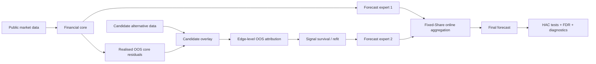

# Market Information Dynamics

### Online model trust under non-stationary financial data

**Research question:** when a new information source looks predictive, how does a forecasting system tell whether that's real out-of-sample signal and how does it know when to stop trusting it?

This is an independent research project on non-stationary prediction, signal decay and online model selection. A financial-market model is treated as a protected core and public physical-economy data plays the role of a deliberately difficult candidate information layer. The candidate data is the public shipping activity, but the method is not tied to that. It is possible to swap in satellite, sentiment, web or microstructure data, using the same framework.

> **Status:** methodology fixed for prospective monitoring from **1 September 2026**. The 2025-2026 results were already inspected while building the method, so they are shown here as reused diagnostics, not as a fresh test period.


## Quick overview

- 12 financial targets across FX, equities, volatility, rates and energy
- 1 / 5 / 10 / 20 trading-day horizons, forecast directly
- Public FRED market data plus IMF PortWatch as the alternative data layer
- Expanding walk forward evaluation with explicit point-in-time availability rules
- Sparse forecasting with edgelevel OOS loss attribution, refitting after selection
- A protected financial core with candidate data residual overlays on top
- Fixed-Share online expert aggregation to adapt model trust after regime changes
- HAC forecast comparison tests and Benjamini–Hochberg FDR control
- A small C++17 layer accelerating one profiled bottleneck, with parity tests and CI
- Negative results are kept in the repository

The full write-up is in [`docs/RESEARCH_NOTE.md`](docs/RESEARCH_NOTE.md) if you want more than the summary here.

## Why this problem

A common failure mode in quant research is confusing "this relationship keeps getting selected" with "this relationship is still useful." In a non-stationary system that's not the same thing, and the harder question isn't just:

> *What predicts the target?*

it's also:

> *How much evidence should a model need before it trusts a signal, how fast should old evidence decay, and how does the system recover once the best model changes?*

That distinction became the focus of the project after the first alternative data hypothesis failed out of sample: see the v1 result below.

## Why this is relevant beyond macro forecasting

The candidate data here happens to be shipping/trade activity, but the actual contribution is deciding how much to trust a model, and how fast to stop
trusting it. It is the same problem a market making or execution system faces
when a strategy's edge decays. The domain is macro, while the method underneath it isn't.

## Research architecture



For each horizon `h ∈ {1, 5, 10, 20}`, the pipeline:

1. fits a financial only direct sparse forecasting model;
2. generates genuine walk forward core forecasts;
3. waits until the complete `h`-step outcome is realised;
4. fits candidate information only to historical OOS core residuals;
5. attributes candidate-edge value from realised marginal forecast-loss reduction;
6. refits surviving candidate edges after sparse discovery;
7. treats the core and candidate overlay forecasts as competing experts;
8. combines them with causal Fixed-Share exponential weighting.

An `h`-step forecast can't touch edge scores or expert weights until that `h`-step outcome is fully observable. 

## Empirical research path

Each stage is kept in the repo, including the ones that didn't work, motivating the next stage.
| Stage | Question | What happened on reused data |
|---|---|---|
| **v1** | Does baseline PortWatch information improve one day forecasts beyond financial history? | No robust incremental value. Mean skill vs financial-only ≈ **-0.10%**; nothing survives FDR. |
| **v2** | Is structural persistence enough to decide which edges survive? | No. Filtering on persistence cut some of the damage, but usually still lost to the financial core. |
| **v3** | Can candidate data explain genuine OOS errors left by a protected core? | Adaptive gating reduced candidate model damage, but only beat the core in **12/48** target horizon comparisons, with no FDR rejections. |
| **v4** | Can online learning adapt trust between the core and candidate model? | Fixed-Share beat the raw survival overlay expert in **42/48** comparisons. Against the core itself, it was roughly flat overall and **+0.11%** mean RMSE skill at 20 days. No FDR-significant improvement. |

This doesn't produce alpha. It produces is a careful way of studying model trust under non-stationarity, plus a  record of what failed along the way.

Full frozen findings, stage by stage:

- [`docs/empirical_v1_findings.md`](docs/empirical_v1_findings.md)
- [`docs/empirical_v2_findings.md`](docs/empirical_v2_findings.md)
- [`docs/empirical_v3_findings.md`](docs/empirical_v3_findings.md)
- [`docs/empirical_v4_findings.md`](docs/empirical_v4_findings.md)

## Fixed-Share model trust

For expert weights `w_k,t` and bounded realised loss `ℓ_k,t`:

```text
w~_k,t+1 ∝ w_k,t exp(-η_t ℓ_k,t)

w_k,t+1 = (1 - α) w~_k,t+1 + α / K
```

The share term is what stops a model from being permanently written off. If the regime changes, a previously weak expert gets a path back in. The share parameter is pre specified at `1/252` per realised update. Nearby values do show up in the results, but only as sensitivity checks, never picked after seeing how they performed.

### Controlled falsification tests

The point of the synthetic tests is that the ground truth is known ahead of time,  so we can actually verify whether the method behaves the way it's supposed to.

**Edge death.** A relationship keeps getting selected by LASSO after its true predictive value has been removed. The survival layer has to tell the difference between a coefficient that's just persistent and one that's still useful.


**Model death.** A candidate expert is genuinely useful early on and then deliberately made worse after a regime switch. Fixed-Share should ramp its weight up while it's helping and pull back toward the core once it stops.

The regime switch demo at the top of this README comes from `online-demo`.

## Statistical design

- direct multi-horizon forecasting 
- expanding walk forward estimation
- target only AR baselines
- LASSO sparse structure discovery
- OOS residual candidate model training
- diagnostics on how long an edge persists, which direction it points and how strong it is; weighted toward recent evidence
- edge level marginal OOS loss attribution
- post selection Ridge refitting
- protected core candidate augmentation
- causal online expert aggregation
- horizon delayed learning updates
- horizon aware HAC forecast loss inference
- Benjamini–Hochberg FDR control
- explicit point-in-time alternativ-data timing
- controlled regime switch falsification tests
- a prospectively frozen evaluation protocol

Directed edges here mean lagged predictive association under the fitted system.

## Data and point-in-time discipline

No employer or proprietary data anywhere in this repo.

- **FRED** - daily FX, equities, volatility, rates and energy series.
- **IMF PortWatch** - public data on maritime chokepoints (ports, straits, canals), pulled in small year by chokepoint batches.
- **Alternative data timing** - physical features get an explicit assumed availability lag; the historical API isn't treated as a perfect vintage archive.
- **Physical transforms** - past only smoothing and 52-week seasonal anomalies.
- **WTI** - first differences instead of log returns, since oil prices briefly went negative in April 2020 and log returns aren't defined for negative numbers.

More detail in [`docs/data_provenance.md`](docs/data_provenance.md).

## Leakage rules

1. No random train/test split for time series claims.
2. No scaler, feature selection or survival statistic sees future observations.
3. Candidate observations can't enter before their assumed availability date.
4. `h`-step targets can't touch models, edge scores or expert weights until fully realised.
5. Candidate models train on historical OOS core residuals
6. Candidate edge utility is measured against the protected financial core.
7. Online expert weights only use already realised forecast losses.
8. Overlapping `h`-step forecast loss tests use horizon aware HAC inference.
9. Multiple target/horizon tests are corrected within pre specified comparison families.

## C++ acceleration

C++ in this project is only used for building lagged design matrices, because that turned out to be the slow in Pyhton.

- exact Python/C++ parity tests
- GitHub Actions coverage
- a benchmark script
- an automatic Python fallback if the native build isn't there

Details in [`docs/cpp_acceleration.md`](docs/cpp_acceleration.md).

## Reproduce

### Windows

```powershell
python -m pip install -e ".[dev]"
python -m pytest -q

# Online aggregation uses the already-generated v3 forecast paths.
powershell -ExecutionPolicy Bypass -File scripts\run_online_aggregation.ps1
```

### Cross-platform

```bash
python -m venv .venv
# activate environment
pip install -e '.[dev]'
pytest

python -m market_information_dynamics.cli empirical-v4 \
  --v3-dir artifacts/empirical_v3 \
  --experiment-config configs/empirical_v4.yaml \
  --out artifacts/empirical_v4
```

Controlled demonstrations:

```bash
python -m market_information_dynamics.cli survival-demo
python -m market_information_dynamics.cli overlay-demo
python -m market_information_dynamics.cli online-demo
```

## Repository map

```text
configs/                     Pre-specified empirical configurations
cpp/                         Optional C++17 acceleration kernel
docs/                        Research specification, evidence notes, protocol
scripts/                     Reproducible Windows / research runners
src/market_information_dynamics/
├── data/                    Public-data ingestion and timing
├── compute/                 Lagged feature construction
├── models/                  Sparse and direct forecasting models
├── online/                  Fixed-Share expert aggregation
├── evaluation/              Walk-forward empirical engines
├── statistics/              FDR, HAC tests, survival diagnostics
└── visualization/           Network, lifecycle and model-trust plots
artifacts/
├── empirical_v1_public/     Frozen v1 evidence
├── empirical_v2_public/     Frozen v2 evidence
├── empirical_v3_public/     Frozen v3 evidence
├── empirical_v4_public/     Frozen v4 evidence
└── synthetic_*              Controlled falsification tests
tests/                       Python + native-backend regression tests
```

## Prospective protocol

The 2025-2026 period was used during the development of the method and is not a clean test window now. The current evaluation rule is frozen for observations from 1 September 2026 onward.

Configuration files and key model artifacts are hashed with SHA-256 in [`docs/prospective_manifest.json`](docs/prospective_manifest.json) (SHA-256). Full protocol in [`docs/prospective_protocol.md`](docs/prospective_protocol.md).

## Independence and confidentiality

This repository is independently developed using public data and synthetic tests. It contains no employer data, code, models or proprietary research.
