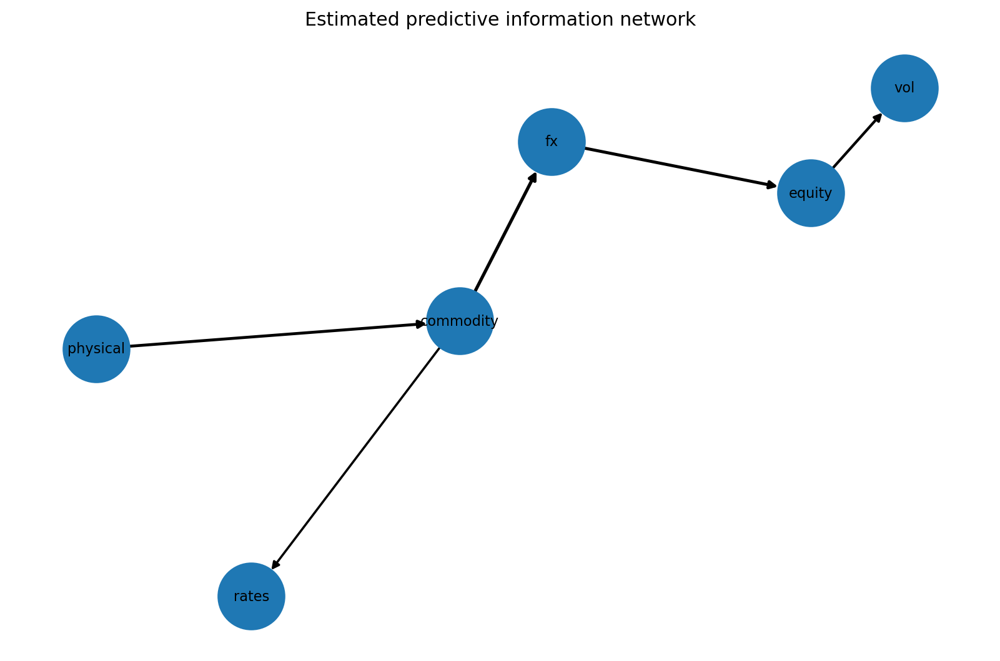
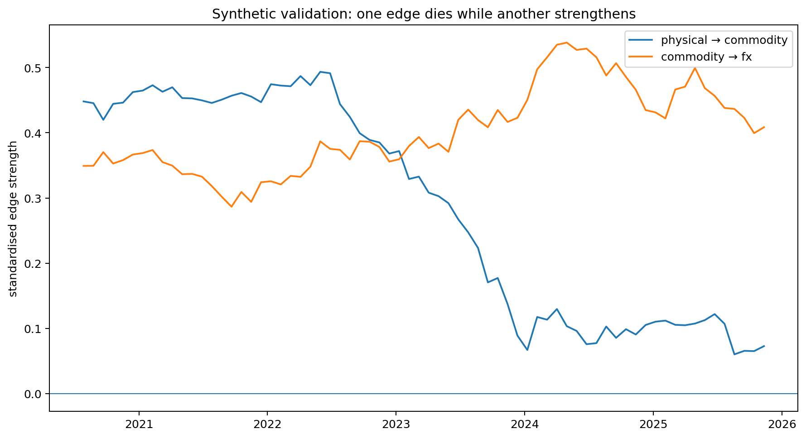

# Market Information Dynamics

### Dynamic information flow, signal survival and price discovery across markets and the physical economy

**Research question:** can we estimate where predictive information first appears, how it
propagates through a mixed physical-financial system, and when previously useful
relationships stop working?

This repository treats markets as a **non-stationary information network** rather than a
collection of isolated time series. Directed edges represent incremental predictive
information under explicit lagged models; they are **not** labelled as structural causal
links.

> **Status — v0.4:** the repository now contains the full pre-specified first empirical
> experiment: public financial + resumable PortWatch ingestion, point-in-time alignment, a paired
> AR / financial-only sparse VAR / financial+physical sparse VAR ablation, historical edge
> survival filtering, HAC forecast-comparison tests with FDR control, a locked 2025+ final
> holdout, availability-lag sensitivity, automatic audits and a machine-generated results
> note. The environment used to build this release cannot make outbound data requests, so
> no real-market result is bundled or claimed; the command is designed to reproduce the
> study locally from the public sources.





## Why this project exists

Most student finance projects begin with an asset and ask which model can predict it. This
project starts with a different problem: **information is distributed, asynchronous and
unstable**. A physical indicator may lead a commodity in one regime, a financial price may
lead the physical economy in another, and an historically strong edge may simply die.

The goal is to build a research framework that can distinguish a plausible, persistent
predictive relationship from correlation mining.

## Current research stack

- **Sparse VAR:** interpretable directed lag network with L1 regularisation.
- **Expanding walk-forward evaluation:** every prediction is produced by a model fitted on
  past data only.
- **Edge survival:** selection frequency, strength and sign stability across refits.
- **Target-only benchmark:** the multivariate model is scored against an autoregressive baseline, not against zero.
- **Point-in-time panel construction:** features enter only when they were actually
  observable.
- **Multiple-testing control:** Benjamini-Hochberg FDR primitive; block-bootstrap tests are
  a planned empirical extension.
- **Synthetic ground truth:** regime switch intentionally kills one edge and strengthens
  another, providing a falsifiable unit test for the research machinery.
- **Public PortWatch adapter:** small per-chokepoint/year ArcGIS queries with local cache/resume, robust chokepoint resolution,
  past-only 52-week seasonal anomalies and explicit availability lags.
- **Optional C++17 kernel:** a native lag-matrix builder for repeated rolling/VAR refits,
  with exact Python parity tests and automatic fallback.
- **Pre-specified empirical ablation:** target-only AR vs financial-only sparse VAR vs
  financial+physical sparse VAR vs a historical edge-stability-filtered version.
- **Paired forecast inference:** HAC Diebold-Mariano-style loss tests with Benjamini-Hochberg
  correction across targets.
- **Locked final holdout:** 2025-01-01 onward is reserved as the untouched reporting segment.
- **Automatic evidence pack:** panel audit, predictions, edge snapshots, stability tables,
  forecast tests, lag-sensitivity summary, figures and a generated `RESULTS.md`.

## Quick start

```bash
python -m venv .venv
source .venv/bin/activate  # Windows: .venv\\Scripts\\activate
pip install -e .[dev]
pytest
python -m market_information_dynamics.cli demo --out artifacts

# Public FRED pilot. No key is required; FRED_API_KEY automatically selects the official API.
python -m market_information_dynamics.cli fred-pilot --start 2019-01-01

# Public IMF PortWatch physical-economy pilot
python -m market_information_dynamics.cli portwatch-pilot

# Joined v1 public-data panel (FRED + PortWatch)
python -m market_information_dynamics.cli public-pilot

# Full pre-specified empirical v1 + 7/14/21-day PortWatch lag sensitivity
python -m market_information_dynamics.cli public-research

# Optional C++17 acceleration
python scripts/build_native.py
python -m market_information_dynamics.cli backend-info
python benchmarks/benchmark_lagged_design.py
```

## Synthetic validation before real markets

The bundled data generator has a known structure:

```text
physical  ─────▶ commodity ─────▶ fx ─────▶ equity
                  │
                  └──────────────▶ rates

equity ─────────────────────────▶ vol (negative)
```

Halfway through the sample, `physical → commodity` is deliberately weakened while
`commodity → fx` becomes stronger. A useful research engine should therefore recover the
main directed relationships **and** show their stability changing through time.

This step is intentional: on financial data the true graph is unknown, so a model that
cannot recover controlled ground truth has no business producing impressive-looking
market networks.

## Leakage rules

1. No random train/test split for time-series claims.
2. No scaling on the full sample.
3. No feature selection using future observations.
4. No macro value before its release timestamp.
5. No revised macro history masquerading as real-time information.
6. No choosing the best lag/asset/horizon after looking at the final test set.
7. Exploratory network edges are not "discoveries" without multiple-testing and stability
   checks.
8. A current historical alternative-data feed is not assumed to reproduce its own
   historical publication vintages.

## Public-data layer

The project is intentionally independent of employer/proprietary datasets.

- **FRED:** `FREDClient` prefers the official API when `FRED_API_KEY` is available and
  otherwise uses FRED's public `fredgraph.csv` endpoint so reviewers can reproduce the
  market-data layer without credentials. Data are fetched at run time and are not vendored.
- **IMF PortWatch:** `PortWatchClient` uses the public ArcGIS chokepoint service, handles
  small cacheable year-by-year queries and turns transit volume/call series into strictly past-referenced rolling
  anomalies. A failed network run can be restarted without redownloading completed chunks.
- **Availability caveat:** the live PortWatch history does not by itself reconstruct every
  historical publication vintage. The first empirical pilot therefore applies an explicit
  conservative lag and treats the source as *lag-modelled*, not vintage-exact.
- Additional adapters are added only when their timestamps, revisions and licences can be
  documented reproducibly.

See [`docs/data_provenance.md`](docs/data_provenance.md).

## Why there is C++ here

The project is Python-first because research iteration speed matters. The C++ code is not a
CV decoration and does not reimplement numerical libraries. It accelerates a deterministic
lag-matrix construction kernel that is repeatedly executed inside rolling and walk-forward
VAR fits. The native path is optional, benchmarked and checked against the Python reference
implementation in CI.

See [`docs/cpp_acceleration.md`](docs/cpp_acceleration.md).

## Empirical research plan

The first public-data release pre-specifies a compact universe and tests:

1. whether cross-series predictive edges survive target autocorrelation and common factors;
2. whether edge stability improves OOS forecasts;
3. whether the graph changes materially through time;
4. whether public physical-economy data adds information beyond financial variables;
5. when physical and financial states disagree, which side subsequently adjusts.

The method is locked before inspecting the **2025-01-01 onward final holdout**. Incremental
physical-data forecast claims are evaluated on paired dates with HAC loss-difference tests
and FDR control, and must also survive the pre-specified PortWatch availability-lag sensitivity.

See [`docs/research_spec.md`](docs/research_spec.md) for the hypotheses and validation
protocol, and [`docs/empirical_v1.md`](docs/empirical_v1.md) for the pre-specified first
real-data ablation.

## Repository layout

```text
cpp/
└── lagged_design.cpp          # optional C++17 hot-path kernel
benchmarks/
└── benchmark_lagged_design.py
scripts/
└── build_native.py
src/market_information_dynamics/
├── compute/
│   └── lagged.py              # Python/native backend abstraction
├── data/
│   ├── fred.py
│   ├── fred_universe.py
│   ├── portwatch.py           # public IMF PortWatch ArcGIS adapter
│   ├── transforms.py
│   ├── physical.py
│   ├── point_in_time.py
│   └── synthetic.py
├── models/
│   ├── sparse_var.py
│   └── autoregressive.py
├── evaluation/
│   ├── walk_forward.py
│   └── empirical.py          # pre-specified real-data ablation
├── statistics/
│   ├── edge_stability.py
│   ├── rolling_edges.py
│   ├── forecast_tests.py     # HAC paired forecast tests
│   └── fdr.py
├── visualization/
│   ├── network.py
│   └── empirical.py
├── reporting.py              # generated non-promotional evidence note
├── demo.py
└── cli.py
```

## Research principles

**Model choice follows the question.** More complicated is not automatically better.
State-space/change-point models, nonlinear methods or graph neural networks are added only
if a clearly defined failure of simpler baselines justifies them.

**Negative results count.** A relationship disappearing out of sample is evidence about
research process, not something to hide.

**Prediction is not causation.** The word "causal" is reserved for designs that genuinely
identify causal effects.

**Optimisation follows profiling.** C++ is used for a measured computational kernel, while
statistical research stays in Python until profiling gives a reason to move it.

## Independence / confidentiality

This is an independent public-data research project inspired by broader questions about
how information moves between the physical economy and financial markets. It contains no
employer data, code, models or proprietary research.

## Roadmap

- [x] Sparse directed lag model
- [x] Leakage-safe walk-forward engine
- [x] Edge-stability diagnostics
- [x] Point-in-time data primitive
- [x] Synthetic regime-switch validation
- [x] CI tests
- [x] Draft compact v0 public-data universe
- [x] Public IMF PortWatch chokepoint adapter
- [x] Explicit alternative-data provenance / availability classification
- [x] Optional C++17 hot-path kernel + parity CI
- [x] Candidate 24-node empirical v1 universe + pre-specified ablation
- [x] Joined financial + physical point-in-time pilot pipeline
- [x] Pre-specified empirical v1 engine + automatic data audit
- [x] Financial-only vs physical+financial paired ablation
- [x] HAC forecast-loss tests + FDR across targets
- [ ] Block-bootstrap / permutation edge significance
- [ ] Time-varying coefficients / online change-point detection
- [ ] Physical-vs-financial dislocation experiment
- [x] Locked 2025+ final holdout + generated results note
- [ ] Run public-research locally and freeze the first empirical evidence pack
- [ ] Research report with final interpretation and robustness appendix
